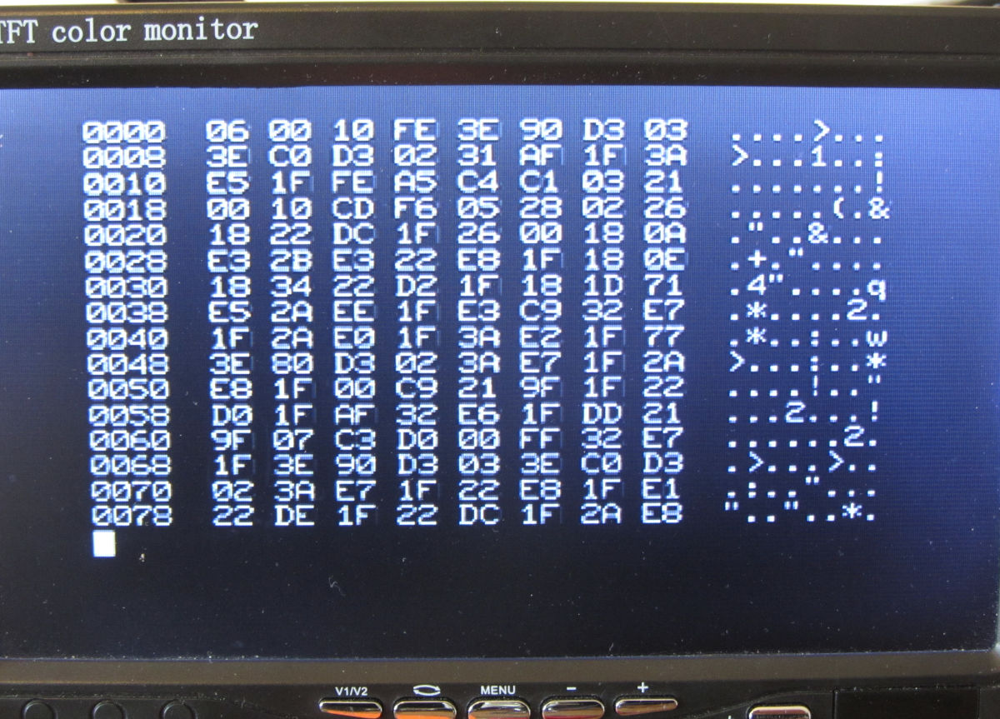
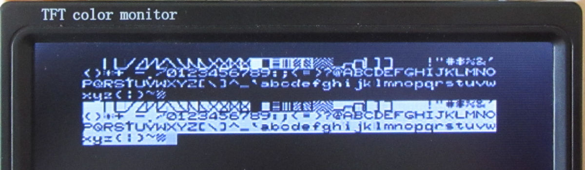

This repository contains the firmware versions for the Bardhele Electronic
VIDEO-MPF-I card. 

More info on my home page: https://www.electrickery.nl/comp/mpf1/index.html

VIO.zip are the hex dumps of the original ROMs that came with the card.

These are the most interesting entry addresses as of version 2.2:

* 0a000h:   clear screen, reset cursor 

* 0a004h:	init 6845, clear screen, return from call
 
* 0a007h:	init 6845, clear screen, jump to 0000h

* 0a00ah:	(JCRTCO) print character in C, interpret control codes

* 0a00dh:	(JCRTOU) print character in C, print codes 00h-31h too

* 0a010h:	(JTEXCO) print 00h terminated string (start in IY)

* 0a013h:	(JTEXCLN) print 00h terminated string (start in IY) with line end (CR/LF)

* 0a016h:	writes character set to screen, jump to 0000h

* 0a019h:   init 6845, clear screen, print banner, rst 0

* 0a01Fh:   hex/ascii memory dump of 8 * 16 bytes, rst 0

The hardware is configured for 8 bit wide, 11 bit high characters, 
limiting the screen to 40 x 20 characters (PAL timing). A proper video 
standard is useful as it allows usage of small, cheap TFT screens.

The assembly code is not very well understood, and used to contain multiple 
usages of un-occupied memory (0ff04h - 0ffcch range). It works, as long as
all unused memory returns 0FFh (EPROM installed). This dead code is now
succesfully removed now (entry points still work). It may have been part of a 
debugging tool.

The new code is initially assembled for and tested via the MicroProfessor 
U7 socket at 02000h. The VIO-MPF-I 1.2 PCB ROM 0A000h socket also works. 

Screenshot of the first page of the Monitor ROM:

Schema of the original Bardhele VIDEO-MPF-I:

The 8x9 FONT ROM works ok with the 40x25 mode:

